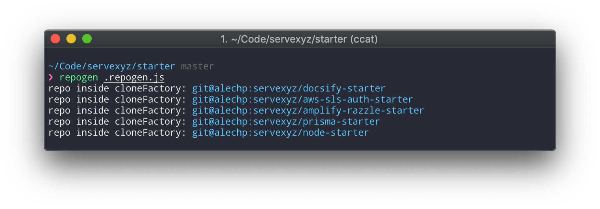

> What: Monolith of related, stack-specific boilerplate projects.
> 
> Why: Inspired by frustration with DX around existing boilerplates.
>
> Who: This repo ("STARTER") is intended for maintainers of these boilerplates. If you're seeking to use any of the boilerplates, I recommend using them individually as needed. You'll find links and descriptions below

## Getting Started
> Who: Boilerplate maintainers

```bash
git clone https://github.com/servexyz/starter
cd starter
npx repogen .repogen.js
```

### What You'll See



## Projects
> Who: Boilerplate users

### Active - `Maintained`

> These are active. Currently utilized in ongoing private projects.

| Effort Level (:star:/4)             | Code Name | Name                                                                       | Description                                                                       |
|--------------------------|-----------|----------------------------------------------------------------------------|-----------------------------------------------------------------------------------|
| :star::star::star::star: | `NSTAR`   | [`node-starter`](https://github.com/servexyz/node-starter)                 | Starting point for node projects (servers and modules namely; not targeting CLIs) |
| :star::star::star:       | `PRSTAR`  | [`prisma-starter`](https://github.com/servexyz/prisma-starter)             | Dockerized prisma.io & MySQL starting point                                       |
| :star:                   | `DOCSTAR` | [`docsify-starter`](https://github.com/servexyz/docsify-starter)           | Dockerized docsify starting point                                                 |
| :star::star::star:       | `SLSTAR`  | [`aws-sls-auth-starter`](https://github.com/servexyz/aws-sls-auth-starter) | Serverless Node.js functions & AWS Cognito                                        |

---

### Active - `Helpers`

> These projects are used within active starters, but are not standalone boilerplate projects

| Effort Level (:star:/4) | Name                                                                                 | Description                                                               |
|--------------|--------------------------------------------------------------------------------------|---------------------------------------------------------------------------|
| :star::star: | [`aws-sls-auther`](https://github.com/servexyz/aws-sls-auther)                       | AWS Cognito module to help test `SLSTAR`                                  |
| :star:       | [`npm-starter-sample-module`](https://github.com/servexyz/npm-starter-sample-module) | Node module to confirm that modules are being parsed correctly by webpack |

---

### Active - `Outdated & unused`

> These are strictly for reference purposes. Currently unused in ongoing private projects.

| Code Name | Name                                                                           | Description                                                  |
|-----------|--------------------------------------------------------------------------------|--------------------------------------------------------------|
| `AMPSTAR` | [`amplify-razzle-starter`](https://github.com/servexyz/amplify-razzle-starter) | Playing around with AWS Amplify and Razzle (CRA alternative) |
